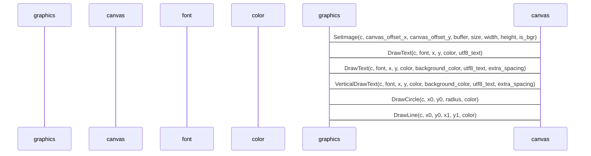

```mermaid
sequenceDiagram
  participant "graphics.cc" as graphics
  participant "Canvas" as canvas
  participant "Font" as font
  participant "Color" as color

  graphics -> canvas: SetImage(c, canvas_offset_x, canvas_offset_y, buffer, size, width, height, is_bgr)
  graphics -> canvas: DrawText(c, font, x, y, color, utf8_text)
  graphics -> canvas: DrawText(c, font, x, y, color, background_color, utf8_text, extra_spacing)
  graphics -> canvas: VerticalDrawText(c, font, x, y, color, background_color, utf8_text, extra_spacing)
  graphics -> canvas: DrawCircle(c, x0, y0, radius, color)
  graphics -> canvas: DrawLine(c, x0, y0, x1, y1, color)
```
