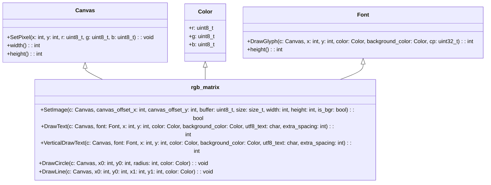

```mermaid
classDiagram
    class Canvas {
        +SetPixel(x: int, y: int, r: uint8_t, g: uint8_t, b: uint8_t): void
        +width(): int
        +height(): int
    }
    class Color {
        +r: uint8_t
        +g: uint8_t
        +b: uint8_t
    }
    class Font {
        +DrawGlyph(c: Canvas, x: int, y: int, color: Color, background_color: Color, cp: uint32_t): int
        +height(): int
    }
    class rgb_matrix {
        +SetImage(c: Canvas, canvas_offset_x: int, canvas_offset_y: int, buffer: uint8_t, size: size_t, width: int, height: int, is_bgr: bool): bool
        +DrawText(c: Canvas, font: Font, x: int, y: int, color: Color, background_color: Color, utf8_text: char, extra_spacing: int): int
        +VerticalDrawText(c: Canvas, font: Font, x: int, y: int, color: Color, background_color: Color, utf8_text: char, extra_spacing: int): int
        +DrawCircle(c: Canvas, x0: int, y0: int, radius: int, color: Color): void
        +DrawLine(c: Canvas, x0: int, y0: int, x1: int, y1: int, color: Color): void
    }
    Canvas <|-- rgb_matrix
    Color <|-- rgb_matrix
    Font <|-- rgb_matrix
```
