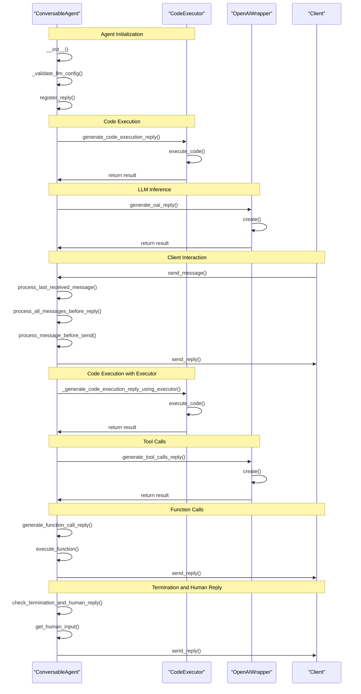

```mermaid
sequenceDiagram
    participant Agent as "ConversableAgent"
    participant CodeExecutor as "CodeExecutor"
    participant OpenAIWrapper as "OpenAIWrapper"
    participant Client as "Client"

    Note over Agent, CodeExecutor: Agent Initialization
    Agent->>Agent: __init__()
    Agent->>Agent: _validate_llm_config()
    Agent->>Agent: register_reply()

    Note over Agent, CodeExecutor: Code Execution
    Agent->>CodeExecutor: generate_code_execution_reply()
    CodeExecutor->>CodeExecutor: execute_code()
    CodeExecutor->>Agent: return result

    Note over Agent, OpenAIWrapper: LLM Inference
    Agent->>OpenAIWrapper: generate_oai_reply()
    OpenAIWrapper->>OpenAIWrapper: create()
    OpenAIWrapper->>Agent: return result

    Note over Agent, Client: Client Interaction
    Client->>Agent: send_message()
    Agent->>Agent: process_last_received_message()
    Agent->>Agent: process_all_messages_before_reply()
    Agent->>Agent: process_message_before_send()
    Agent->>Client: send_reply()

    Note over Agent, CodeExecutor: Code Execution with Executor
    Agent->>CodeExecutor: _generate_code_execution_reply_using_executor()
    CodeExecutor->>CodeExecutor: execute_code()
    CodeExecutor->>Agent: return result

    Note over Agent, OpenAIWrapper: Tool Calls
    Agent->>OpenAIWrapper: generate_tool_calls_reply()
    OpenAIWrapper->>OpenAIWrapper: create()
    OpenAIWrapper->>Agent: return result

    Note over Agent, Client: Function Calls
    Agent->>Agent: generate_function_call_reply()
    Agent->>Agent: execute_function()
    Agent->>Client: send_reply()

    Note over Agent, Client: Termination and Human Reply
    Agent->>Agent: check_termination_and_human_reply()
    Agent->>Agent: get_human_input()
    Agent->>Client: send_reply()
```