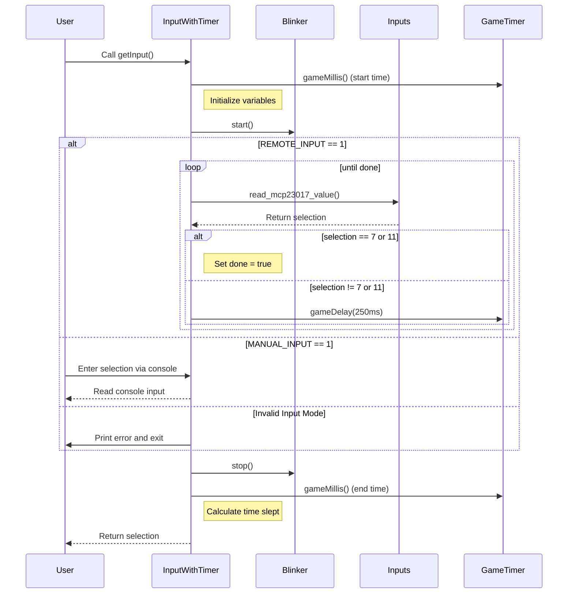

# Persona
- World-class C++ developer seasoned in GoF design patterns.
- Expert in designing C++ Scoreboard systems.

# Context
In the following C++ code, the system listens on its GPIO pins for a remote that is connected to the system.   When any key on the keyboard is pressed, I need to be able to intercept it and use it for a menu selection, so we will need to listen to keyboard inputs as well. 

# Source Code
## Input With Timer
`force the model to program to the interface`

### cpp source code
```c++
class InputWithTimer {
private:
    Blinker* _blinker;
    unsigned long _time_slept;
    Inputs* _inputs;

public:
    InputWithTimer( Blinker* blinker, Inputs* inputs );
    ~InputWithTimer();

    int getInput();
    unsigned long getTimeSlept();
};
```
### Input With Timer Object Mermaid Sequence Diagram


# Main methods
## Remote Listener
```c++
void run_remote_listener(GameObject* gameObject, GameState* gameState, Reset* reset, Inputs* inputs) {
    int loop_count = 0;
    int selection = 0;

    gameObject->loopGame();
    std::this_thread::sleep_for(std::chrono::seconds(1));
    gameObject->getScoreBoard()->setLittleDrawerFont("fonts/8x13B.bdf");
    std::signal(SIGINT, GameObject::_signalHandler);

    RemotePairingScreen remotePairingScreen(gameObject->getScoreBoard());
    PairingBlinker pairingBlinker(gameObject->getScoreBoard());
    InputWithTimer inputWithTimer(&pairingBlinker, inputs);

    bool is_on_pi = gameObject->getScoreBoard()->onRaspberryPi();

    std::thread keyboardThread(keyboardListener);

    while (gameState->gameRunning() && GameObject::gSignalStatus != SIGINT && !stopListening.load()) {
        std::this_thread::sleep_for(std::chrono::milliseconds( REMOTE_SPIN_DELAY ));

        while (remotePairingScreen.inPairingMode() && is_on_pi && pairingBlinker.awake()) {
            selection = inputWithTimer.getInput();
            if (selection == 7) {
                remotePairingScreen.greenPlayerPressed();
                pairingBlinker.setGreenPlayerPaired(true);
            } else if (selection == 11) {
                remotePairingScreen.redPlayerPressed();
                pairingBlinker.setRedPlayerPaired(true);
            }
        }

        if (!pairingBlinker.awake()) {
            pairingBlinker.stop();
            gameState->setCurrentAction(SLEEP_MODE);
        }

        if (gameState->getCurrentAction() == SLEEP_MODE) {
            ScoreboardBlinker blinker(gameObject->getScoreBoard());
            InputWithTimer sleepInput(&blinker, inputs);
            selection = sleepInput.getInput();

            gameState->setCurrentAction(AFTER_SLEEP_MODE);
            if (selection == 7 || selection == 11 || sleepInput.getTimeSlept() > MAX_SLEEP * 1000) {
                gameObject->resetMatch();
                if (sleepInput.getTimeSlept() > MAX_SLEEP * 1000) {
                    gameObject->getHistory()->clearHistory();
                }
                continue;
            }

            gameObject->getScoreBoard()->clearScreen();
            gameObject->getScoreBoard()->update();
        } else {
            selection = inputs->read_mcp23017_value();
        }

        if (selection == 7 || selection == 11) {
            gameObject->playerScore(selection == 7 ? 1 : 2);
            std::this_thread::sleep_for(std::chrono::milliseconds( SLEEP_AFTER_REMOTE_SCORE ));
        }

        gameObject->loopGame();
        loop_count++;
    }

    stopListening.store(true);
    if (keyboardThread.joinable()) {
        keyboardThread.join();
    }
}
```

## Manual Listener
```c++
void run_manual_game( GameObject* gameObject, GameState* gameState, Reset* reset, int player ) {
    int loop_count = 0;
    gameObject->loopGame();
    sleep( 1 );
    int menu_selection = 1;
    Inputs* inputs = new Inputs( gameObject->getPlayer1(), gameObject->getPlayer2(), gameObject->getPinInterface(), gameState );
    gameObject->getScoreBoard()->setLittleDrawerFont( "fonts/8x13B.bdf" );
    std::signal( SIGINT, GameObject::_signalHandler );
    RemotePairingScreen remotePairingScreen( gameObject->getScoreBoard() );
    print( "constructing pairing blinker from run manual game" );
    PairingBlinker pairingBlinker( gameObject->getScoreBoard() );  // Use PairingBlinker
    print( "constructing input with timer from run manual game" );
    InputWithTimer inputWithTimer( &pairingBlinker, inputs );  // Pass PairingBlinker
    print( "finished constructing input with timer from run manual game" );
    bool is_on_pi = gameObject->getScoreBoard()->onRaspberryPi();
    print( "is_on_pi: " + std::to_string( is_on_pi ) );
    while ( gameState->gameRunning() && GameObject::gSignalStatus != SIGINT ) { /*/// Begin Game Loop ///*/
        print( "entered while loop from run manual game" );
        sleep( SCORE_DELAY );
        // if remote pairing, write the words.  if not, snap out of the loop
        while ( remotePairingScreen.inPairingMode() && is_on_pi && pairingBlinker.awake() ) { // 090724
            print( "inside remote pairing screen from run manual game.  before starting input timer..." );
            int menu_selection = inputWithTimer.getInput();
            if ( menu_selection == 1 ) {
                remotePairingScreen.greenPlayerPressed();
                pairingBlinker.setGreenPlayerPaired( true );  // Notify blinker that Green player is paired
            }
            else if ( menu_selection == 2 ) {
                remotePairingScreen.redPlayerPressed();
                pairingBlinker.setRedPlayerPaired( true );  // Notify blinker that Red player is paired
            }
            else {
                std::cout << "*** Invalid selection during remote pairing. ***\n";
                GameTimer::gameDelay( 1000 );
            }
        }

        print( "put in sleep mode if the pairing blinker is not awake. " );
        if ( !pairingBlinker.awake() ) {
            print( "pairing blinker is not awake, stopping it... " )
                pairingBlinker.stop();
            print( "pairing blinker stopped.  now putting in sleep mode..." );
            gameState->setCurrentAction( SLEEP_MODE );
        }

        // pairingBlinker.stop();  // Stop blinking once both players are paired
        std::cout << "1.) green score             76. seven six Tie Breaker test" << std::endl;
        std::cout << "2.) red score                     " << std::endl;
        std::cout << "3.) Demo           " << std::endl;
        std::cout << "4.) Match Win Test " << std::endl;
        std::cout << "5.) Test 05        " << std::endl;
        std::cout << "6.) Match Win Tie Break Test" << std::endl;
        std::cout << "7.) Sleep Mode Test" << std::endl;
        std::cout << "8.) Font File" << std::endl;
        std::cout << "9.) Undo           " << std::endl;
        std::cout << "10.) Test Font     " << std::endl;
        std::cout << "20.) Write Text    " << std::endl;
        std::cout << "104.) Detect Expndr" << std::endl;
        std::cout << "105.) read bits.   " << std::endl;

        if ( gameState->getCurrentAction() == SLEEP_MODE ) {
            ScoreboardBlinker blinker( gameObject->getScoreBoard() );
            InputWithTimer inputWithTimer( &blinker, inputs );
            menu_selection = inputWithTimer.getInput();
            gameState->setCurrentAction( AFTER_SLEEP_MODE ); // stop sleep mode
            std::cout << "time slept: " << inputWithTimer.getTimeSlept() << std::endl;
            if ( menu_selection == 1 ||
                  menu_selection == 2 ||
                 ( inputWithTimer.getTimeSlept() > MAX_SLEEP * 1000 ) ) { // and sleep time expired...
                print( "reset match." );
                gameObject->resetMatch();
                print( "done resetting match." );
                if ( inputWithTimer.getTimeSlept() > MAX_SLEEP * 1000 ) {
                    print( "time slept: " << inputWithTimer.getTimeSlept() / 1000 << " seconds." << std::endl );
                    print( "clearing History because max sleep time has been reached or exceeded." );
                    gameObject->getHistory()->clearHistory();
                    print( "done clearing history because max sleep time has been reached or exceeded." );
                }
                continue;
            }
            print( "setting game state current action to after sleep mode" );
            gameState->setCurrentAction( AFTER_SLEEP_MODE );
            print( "*** Going into last Match! ***" );
            print( "clearing screen..." );
            gameObject->getScoreBoard()->clearScreen();
            print( "cleared screen." );
            gameObject->getScoreBoard()->update();
            print( "updated scoreboard." );
        }
        else {
            std::cin >> menu_selection;
        }

        if ( menu_selection == 20 ) {
            std::cout << "Enter the message to write: ";
            std::string message;
            // std::getline(std::cin, message);  // get input from the user // never works
            std::cin >> message;
            gameObject->getScoreBoard()->clearScreen();
            gameObject->getScoreBoard()->drawNewText( message, 5, 20 );
            GameTimer::gameDelay( 1000 );
            continue;
        }

        if ( menu_selection == 10 ) {
            get_and_set_font( gameObject );
            // pairingBlinker.enable();
            // remotePairingScreen.enablePairingMode();
            continue;
        }

        if ( menu_selection == 1 || menu_selection == 2 ) {
            gameObject->playerScore( menu_selection );  // flip the player score flag
            sleep( SCORE_DELAY );
        }
        else if ( menu_selection == 0 ) {
            std::cout << "*** Exiting... ***\n" << std::endl;
            exit( 0 );
        }
        else if ( menu_selection == 8 ) {
            // get font file from user
            std::string font_file;
            std::cout << "Enter the path to the font file: ";
            std::getline( std::cin, font_file );  // get input from the user

            // Check if file exists
            std::ifstream file_check( font_file );
            if ( !file_check ) {
                std::cerr << "Warning: The specified font file does not exist.\n";
                return;  // Continue with the program flow without setting the font file
            }

            // If the file exists, set the font file
            gameObject->getScoreBoard()->setFontFile( font_file.c_str() );
        }
        else if ( menu_selection == 9 ) {
            std::cout << "\n\n\n\n\n\n\n*** Undo ***\n" << std::endl;
            gameObject->undo(); // day before election day 110424
            gameState->setCurrentAction( NORMAL_GAME_STATE );
            sleep( SCORE_DELAY );
        }
        else if ( menu_selection == 11 ) {
            std::cout << "\n\n\n\n\n\n\n*** Player 1 win ***\n" << std::endl;
            playerWin( gameObject, gameState, 1 );
            sleep( SCORE_DELAY );
        }
        else if ( menu_selection == 22 ) {
            std::cout << "\n\n\n\n\n\n\n*** Player 2 win ***\n" << std::endl;
            playerWin( gameObject, gameState, 2 );
            sleep( SCORE_DELAY );
        }
        else if ( menu_selection == 101 ) {
            resetAll( reset );
            std::cout << "\n\n\n\n\n\n\n*** Test 01 ***\n" << std::endl;
            gameObject->getScoreBoard()->clearScreen();
            gameObject->getScoreBoard()->drawText( "Test", X__POS, Y__POS );
            gameObject->getScoreBoard()->drawText( " 01 ", X__POSITION, Y__POSITION );
            GameTimer::gameDelay( 4000 );
            test_01( gameObject, gameState, &loop_count );
            sleep( SCORE_DELAY );
            continue;
        }
        else if ( menu_selection == 3 ) {
            resetAll( reset );
            std::cout << "\n\n\n\n\n\n\n*** Demo ***\n" << std::endl;
            demo_test( gameObject, gameState, &loop_count );
            sleep( SCORE_DELAY );
            continue;
        }
        else if ( menu_selection == 103 ) {
            resetAll( reset );
            std::cout << "\n\n\n\n\n\n\n*** Test 03 ***\n" << std::endl;
            test_03( gameObject, gameState, &loop_count );
            sleep( SCORE_DELAY );
            continue;

        }
        else if ( menu_selection == 104 ) {
            std::cout << "\n*** Running MCP23017 Expander Detection Test ***\n";
            detectExpander();
            sleep( SCORE_DELAY );
            continue;

        }
        else if ( menu_selection == 105 ) {
            std::cout << "reading MCP23017 bits..." << std::endl;
            int file = open( I2C_DEVICE, O_RDWR );

            if ( file < 0 ) {
                std::cerr << "Error: Unable to open I2C device.\n";
                continue;
            }

            if ( ioctl( file, I2C_SLAVE, MCP23017_ADDRESS ) < 0 ) {
                std::cerr << "Error: Unable to set I2C address.\n";
                close( file );
                continue;
            }
            int is_one;
            while ( 1 ) {
                std::cin >> is_one;
                if ( is_one == 1 ) {
                    break;
                }
                else {
                    readBits( file );
                }
            }
            close( file );
            continue;
        }
        else if ( menu_selection == 5 ) {
            resetAll( reset );
            std::cout << "\n\n\n\n\n\n\n*** Test 05 ***\n" << std::endl;
            test_05( gameObject, gameState, &loop_count );
            sleep( SCORE_DELAY );
            continue;
        }

        else if ( menu_selection == 6 ) {
            resetAll( reset );
            std::cout << "\n\n\n\n\n\n\n*** Match Win Tie Break Test ***\n" << std::endl;
            matchWinTieBreakerTest( gameObject, gameState );
            sleep( SCORE_DELAY );
            continue;
        }

        else if ( menu_selection == 4 ) {
            matchWinTest( gameObject, gameState );
            sleep( SCORE_DELAY );
            continue;

        }
        else if ( menu_selection == 7 ) {
            gameState->setCurrentAction( SLEEP_MODE );
            sleep( SCORE_DELAY );
            continue;
        }
        else if ( menu_selection == 76 ) {
            tieBreakerSevenSixTest( gameObject, gameState );
            sleep( SCORE_DELAY );
            continue;
        }
        else {
            std::cout << "\n\n\n\n\n\n\n*** Invalid selection ***\n" << std::endl;
            sleep( SCORE_DELAY );
            continue;
        }
        gameObject->loopGame();  // handle the player score flag
        loop_count++;
        std::map<int, int> _player1_set_history = gameState->getPlayer1SetHistory();
        std::map<int, int> _player2_set_history = gameState->getPlayer2SetHistory();
    } ///////// End Game Loop /////////
}
```

# Your Task
Please write a run_remote_keyboard() method to listen for keyboard ( << cin ) AND remote inputs so that we are able to respond to the menu selections from the systems stdin and the inputs from the GPIO pins.  So I would like you to somehow combine the above two main methods to allow this simultaneous listening to be possible.