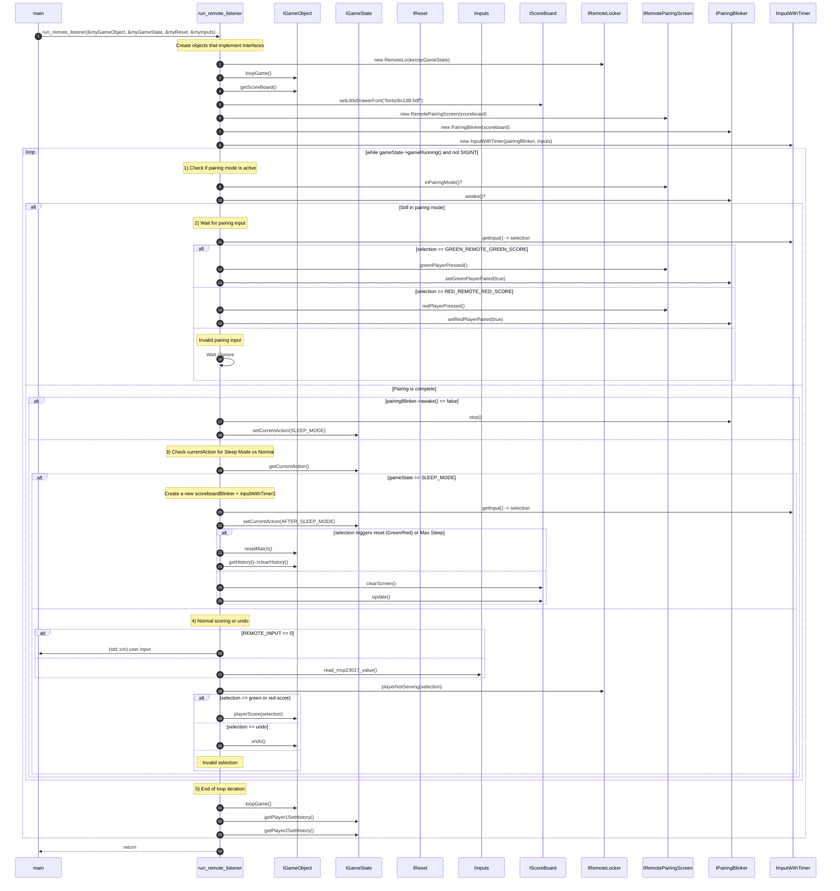

```mermaid
sequenceDiagram
    autonumber

    participant main
    participant run_remote_listener
    participant gameObject as IGameObject
    participant gameState as IGameState
    participant reset as IReset
    participant inputs as IInputs
    participant scoreboard as IScoreBoard
    participant remoteLocker as IRemoteLocker
    participant remotePairingScreen as IRemotePairingScreen
    participant pairingBlinker as IPairingBlinker
    participant inputWithTimer as IInputWithTimer

    %% main calls run_remote_listener
    main->>run_remote_listener: run_remote_listener(&myGameObject, &myGameState, &myReset, &myInputs)

    Note over run_remote_listener: Create objects that implement interfaces
    run_remote_listener->>remoteLocker: new RemoteLocker(spGameState)
    run_remote_listener->>gameObject: loopGame()
    run_remote_listener->>gameObject: getScoreBoard()
    run_remote_listener->>scoreboard: setLittleDrawerFont("fonts/8x13B.bdf")

    run_remote_listener->>remotePairingScreen: new RemotePairingScreen(scoreboard)
    run_remote_listener->>pairingBlinker: new PairingBlinker(scoreboard)
    run_remote_listener->>inputWithTimer: new InputWithTimer(pairingBlinker, inputs)

    loop while gameState->gameRunning() and not SIGINT
        Note over run_remote_listener: 1) Check if pairing mode is active
        run_remote_listener->>remotePairingScreen: inPairingMode()?
        run_remote_listener->>pairingBlinker: awake()?

        alt Still in pairing mode
            Note over run_remote_listener: 2) Wait for pairing input
            run_remote_listener->>inputWithTimer: getInput() -> selection

            alt selection == GREEN_REMOTE_GREEN_SCORE
                run_remote_listener->>remotePairingScreen: greenPlayerPressed()
                run_remote_listener->>pairingBlinker: setGreenPlayerPaired(true)
            else selection == RED_REMOTE_RED_SCORE
                run_remote_listener->>remotePairingScreen: redPlayerPressed()
                run_remote_listener->>pairingBlinker: setRedPlayerPaired(true)
            else
                Note over run_remote_listener: Invalid pairing input
                run_remote_listener->>run_remote_listener: Wait / Ignore
            end

        else Pairing is complete
            alt pairingBlinker->awake() == false
                run_remote_listener->>pairingBlinker: stop()
                run_remote_listener->>gameState: setCurrentAction(SLEEP_MODE)
            else
                Note over run_remote_listener: 3) Check currentAction for Sleep Mode vs Normal
                run_remote_listener->>gameState: getCurrentAction()

                alt gameState == SLEEP_MODE
                    Note over run_remote_listener: Create a new scoreboardBlinker + inputWithTimer2
                    run_remote_listener->>inputWithTimer: getInput() -> selection
                    run_remote_listener->>gameState: setCurrentAction(AFTER_SLEEP_MODE)

                    alt selection triggers reset (Green/Red) or Max Sleep
                        run_remote_listener->>gameObject: resetMatch()
                        run_remote_listener->>gameObject: getHistory()->clearHistory()
                    else
                        run_remote_listener->>scoreboard: clearScreen()
                        run_remote_listener->>scoreboard: update()
                    end
                else
                    Note over run_remote_listener: 4) Normal scoring or undo
                    alt REMOTE_INPUT == 0
                        run_remote_listener->>main: (std::cin) user input
                    else
                        run_remote_listener->>inputs: read_mcp23017_value()
                    end
                    run_remote_listener->>remoteLocker: playerNotServing(selection)

                    alt selection => green or red score
                        run_remote_listener->>gameObject: playerScore(selection)
                    else selection => undo
                        run_remote_listener->>gameObject: undo()
                    else
                        Note over run_remote_listener: Invalid selection
                    end
                end
            end
        end

        Note over run_remote_listener: 5) End of loop iteration
        run_remote_listener->>gameObject: loopGame()
        run_remote_listener->>gameState: getPlayer1SetHistory()
        run_remote_listener->>gameState: getPlayer2SetHistory()
    end

    run_remote_listener-->>main: return
```