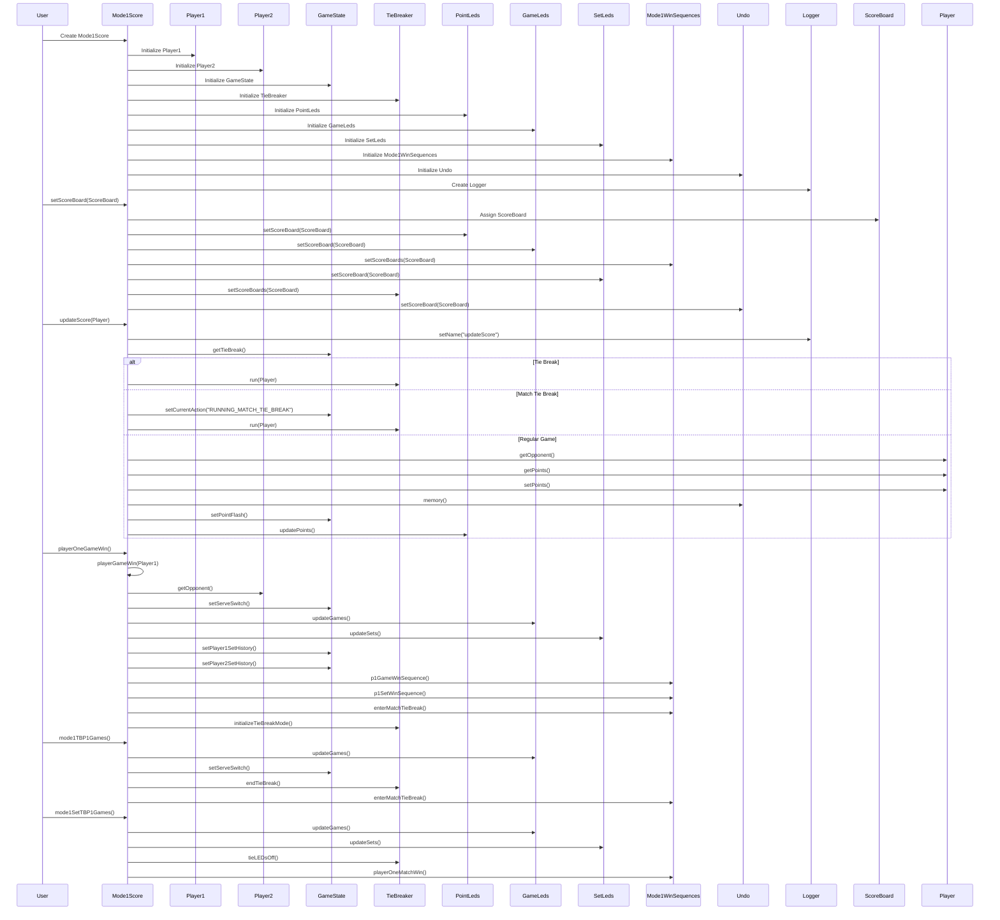

```mermaid
sequenceDiagram
    participant User
    participant Mode1Score
    participant Player1
    participant Player2
    participant GameState
    participant TieBreaker
    participant PointLeds
    participant GameLeds
    participant SetLeds
    participant Mode1WinSequences
    participant Undo
    participant Logger
    participant ScoreBoard

    User->>Mode1Score: Create Mode1Score
    Mode1Score->>Player1: Initialize Player1
    Mode1Score->>Player2: Initialize Player2
    Mode1Score->>GameState: Initialize GameState
    Mode1Score->>TieBreaker: Initialize TieBreaker
    Mode1Score->>PointLeds: Initialize PointLeds
    Mode1Score->>GameLeds: Initialize GameLeds
    Mode1Score->>SetLeds: Initialize SetLeds
    Mode1Score->>Mode1WinSequences: Initialize Mode1WinSequences
    Mode1Score->>Undo: Initialize Undo
    Mode1Score->>Logger: Create Logger

    User->>Mode1Score: setScoreBoard(ScoreBoard)
    Mode1Score->>ScoreBoard: Assign ScoreBoard
    Mode1Score->>PointLeds: setScoreBoard(ScoreBoard)
    Mode1Score->>GameLeds: setScoreBoard(ScoreBoard)
    Mode1Score->>Mode1WinSequences: setScoreBoards(ScoreBoard)
    Mode1Score->>SetLeds: setScoreBoard(ScoreBoard)
    Mode1Score->>TieBreaker: setScoreBoards(ScoreBoard)
    Mode1Score->>Undo: setScoreBoard(ScoreBoard)

    User->>Mode1Score: updateScore(Player)
    Mode1Score->>Logger: setName("updateScore")
    Mode1Score->>GameState: getTieBreak()
    alt Tie Break
        Mode1Score->>TieBreaker: run(Player)
    else Match Tie Break
        Mode1Score->>GameState: setCurrentAction("RUNNING_MATCH_TIE_BREAK")
        Mode1Score->>TieBreaker: run(Player)
    else Regular Game
        Mode1Score->>Player: getOpponent()
        Mode1Score->>Player: getPoints()
        Mode1Score->>Player: setPoints()
        Mode1Score->>Undo: memory()
        Mode1Score->>GameState: setPointFlash()
        Mode1Score->>PointLeds: updatePoints()
    end

    User->>Mode1Score: playerOneGameWin()
    Mode1Score->>Mode1Score: playerGameWin(Player1)
    Mode1Score->>Player2: getOpponent()
    Mode1Score->>GameState: setServeSwitch()
    Mode1Score->>GameLeds: updateGames()
    Mode1Score->>SetLeds: updateSets()
    Mode1Score->>GameState: setPlayer1SetHistory()
    Mode1Score->>GameState: setPlayer2SetHistory()
    Mode1Score->>Mode1WinSequences: p1GameWinSequence()
    Mode1Score->>Mode1WinSequences: p1SetWinSequence()
    Mode1Score->>Mode1WinSequences: enterMatchTieBreak()
    Mode1Score->>TieBreaker: initializeTieBreakMode()

    User->>Mode1Score: mode1TBP1Games()
    Mode1Score->>GameLeds: updateGames()
    Mode1Score->>GameState: setServeSwitch()
    Mode1Score->>TieBreaker: endTieBreak()
    Mode1Score->>Mode1WinSequences: enterMatchTieBreak()

    User->>Mode1Score: mode1SetTBP1Games()
    Mode1Score->>GameLeds: updateGames()
    Mode1Score->>SetLeds: updateSets()
    Mode1Score->>TieBreaker: tieLEDsOff()
    Mode1Score->>Mode1WinSequences: playerOneMatchWin()
```