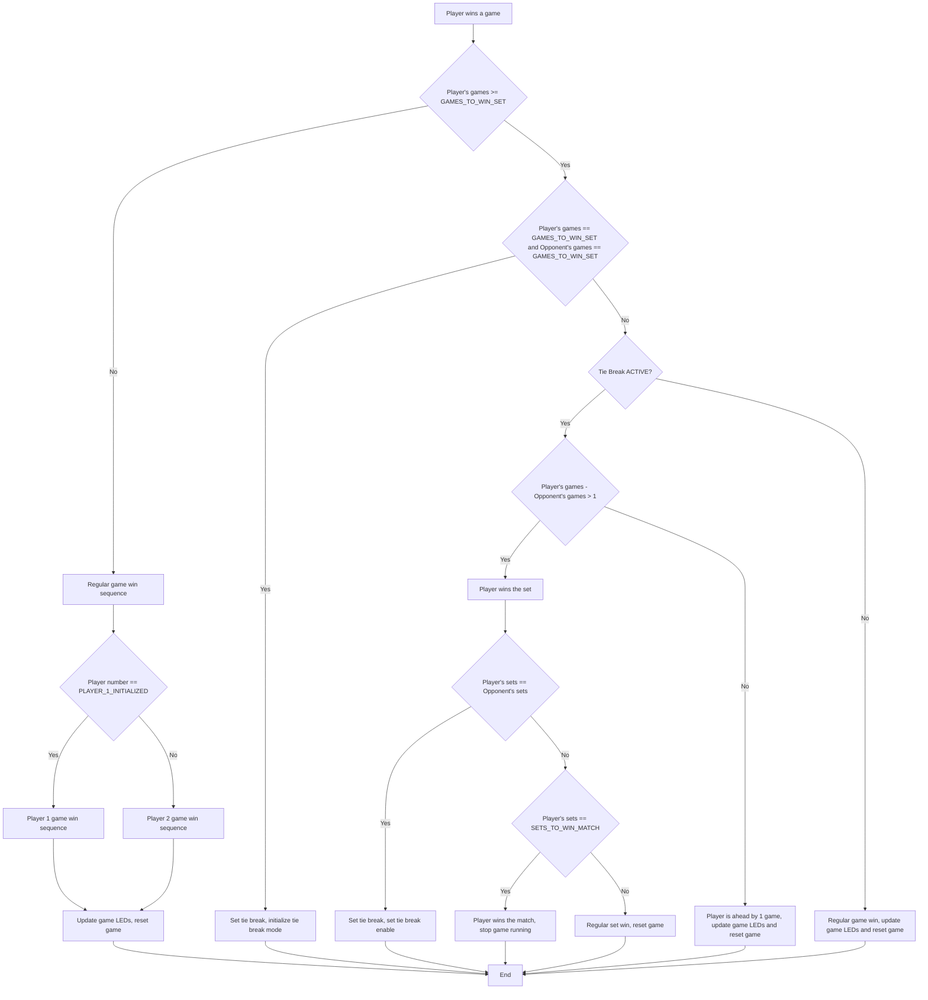

```mermaid
graph TD
    A[Player wins a game] --> B{Player's games >= GAMES_TO_WIN_SET}
    B -->|Yes| C{Player's games == GAMES_TO_WIN_SET and Opponent's games == GAMES_TO_WIN_SET}
    B -->|No| D[Regular game win sequence]
    C -->|Yes| E[Set tie break, initialize tie break mode]
    C -->|No| F{Tie Break ACTIVE?}
    F -->|Yes| G{Player's games - Opponent's games > 1}
    G -->|Yes| H[Player wins the set]
    H --> I{Player's sets == Opponent's sets}
    I -->|Yes| J[Set tie break, set tie break enable]
    I -->|No| K{Player's sets == SETS_TO_WIN_MATCH}
    K -->|Yes| L[Player wins the match, stop game running]
    K -->|No| M[Regular set win, reset game]
    G -->|No| N[Player is ahead by 1 game, update game LEDs and reset game]
    F -->|No| O[Regular game win, update game LEDs and reset game]

    D --> P{Player number == PLAYER_1_INITIALIZED}
    P -->|Yes| Q[Player 1 game win sequence]
    P -->|No| R[Player 2 game win sequence]
    Q --> S[Update game LEDs, reset game]
    R --> S
    S --> T[End]

    E --> T
    J --> T
    L --> T
    M --> T
    N --> T
    O --> T
```
