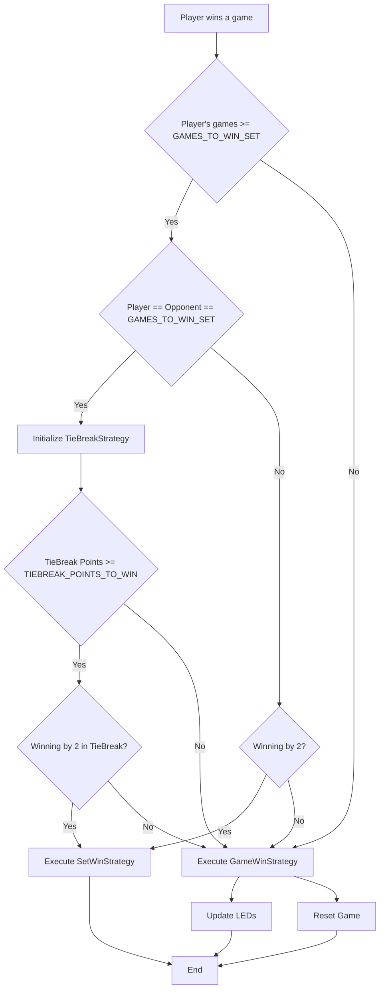

```mermaid
graph TD
    A[Player wins a game] --> B{Player's games >= GAMES_TO_WIN_SET}
    B -->|Yes| C{Player == Opponent == GAMES_TO_WIN_SET}
    B -->|No| D[Execute GameWinStrategy]
    C -->|Yes| E[Initialize TieBreakStrategy]
    C -->|No| F{Winning by 2?}
    F -->|Yes| H[Execute SetWinStrategy]
    F -->|No| D
    E --> J{TieBreak Points >= TIEBREAK_POINTS_TO_WIN}
    J -->|Yes| K{Winning by 2 in TieBreak?}
    K -->|Yes| H[Execute SetWinStrategy]
    K -->|No| D
    J -->|No| D
    D --> L[Update LEDs]
    D --> M[Reset Game]
    H --> N[End]
    L --> N
    M --> N

```

