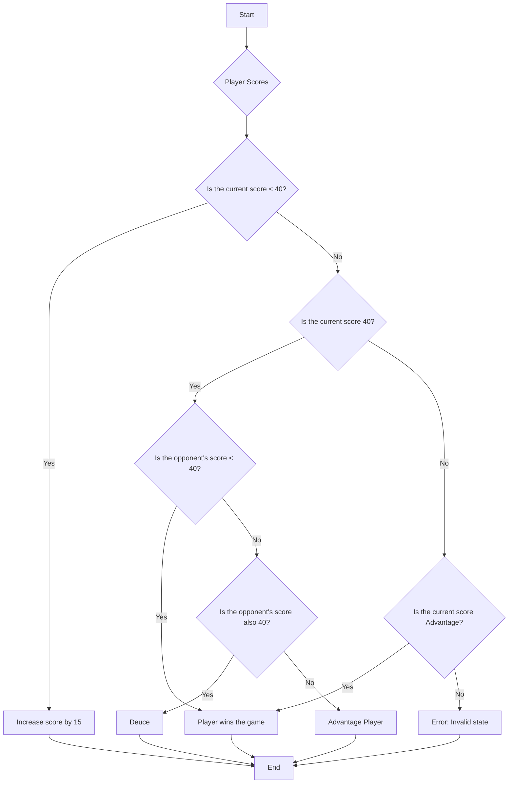

```mermaid
flowchart TD
    A[Start] --> B{Player Scores}
    B --> C{Is the current score < 40?}
    C -->|Yes| D[Increase score by 15]
    C -->|No| E{Is the current score 40?}
    E -->|Yes| F{Is the opponent's score < 40?}
    F -->|Yes| G[Player wins the game]
    F -->|No| H{Is the opponent's score also 40?}
    H -->|Yes| I[Deuce]
    H -->|No| J[Advantage Player]
    E -->|No| K{Is the current score Advantage?}
    K -->|Yes| G[Player wins the game]
    K -->|No| L[Error: Invalid state]
    G --> M[End]
    D --> M[End]
    I --> M[End]
    J --> M[End]
    L --> M[End]
```
