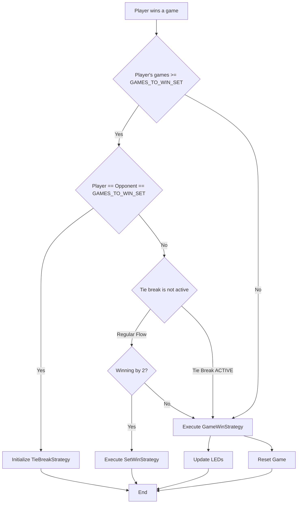

Act as an expert Tennis Game Software Developer.

Please analyze the following diagram an check it's accuracy for tennis rules.  I'm not sure if

```mermaid
graph TD
    A[Player wins a game] --> B{Player's games >= GAMES_TO_WIN_SET}
    B -->|Yes| C{Player == Opponent == GAMES_TO_WIN_SET}
    B -->|No| D[Execute GameWinStrategy]
    C -->|Yes| E[Initialize TieBreakStrategy]
    C -->|No| F{Tie break is not active}
    F -->|Regular Flow | G{Winning by 2?}
    G -->|Yes| H[Execute SetWinStrategy]
    G -->|No| D
    F -->|Tie Break ACTIVE| D
    D --> K[Update LEDs]
    D --> L[Reset Game]
    E --> M[End]
    H --> M
    K --> M
    L --> M

```
