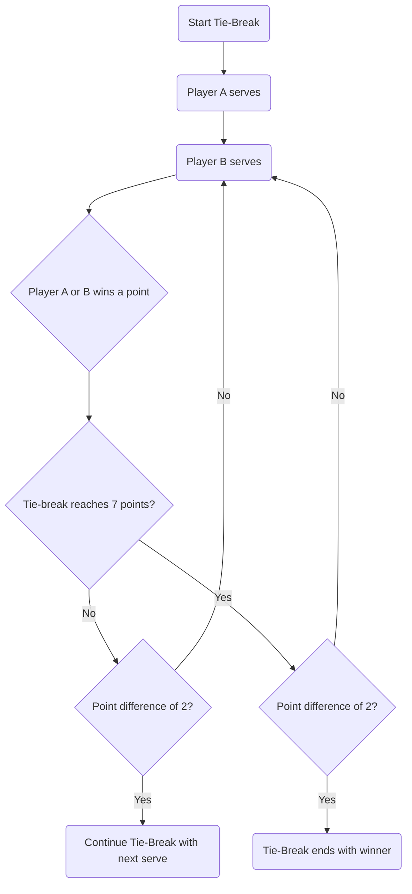

```mermaid
flowchart TD
    A(Start Tie-Break) --> B(Player A serves)
    B --> C(Player B serves)
    C --> D{Player A or B wins a point}
    D --> E{Tie-break reaches 7 points?}
    E -- No --> F{Point difference of 2?}
    F -- Yes --> G(Continue Tie-Break with next serve)
    F -- No --> C
    E -- Yes --> H{Point difference of 2?}
    H -- Yes --> I(Tie-Break ends with winner)
    H -- No --> C
```
