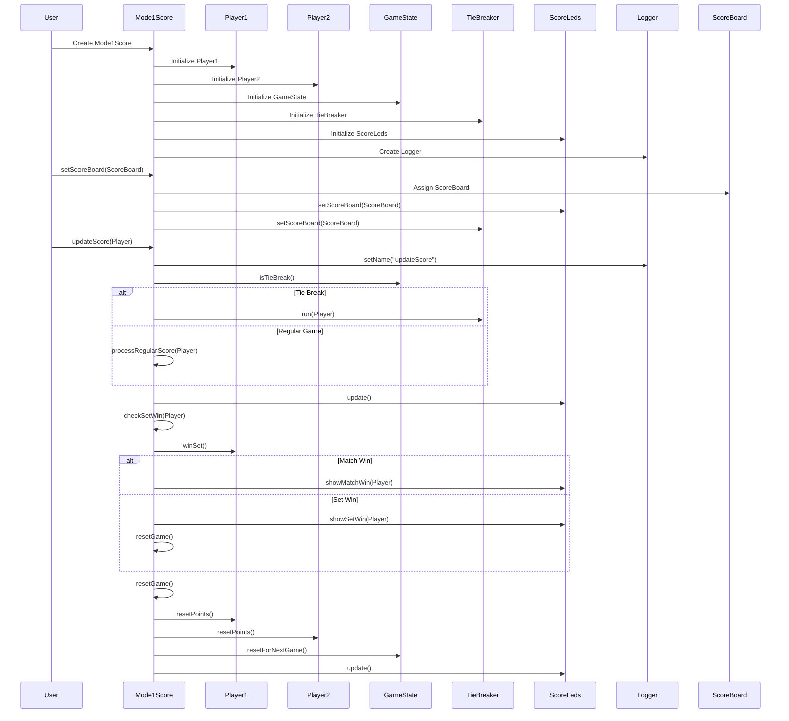

```mermaid
sequenceDiagram
    participant User
    participant Mode1Score
    participant Player1
    participant Player2
    participant GameState
    participant TieBreaker
    participant ScoreLeds
    participant Logger
    participant ScoreBoard

    User->>Mode1Score: Create Mode1Score
    Mode1Score->>Player1: Initialize Player1
    Mode1Score->>Player2: Initialize Player2
    Mode1Score->>GameState: Initialize GameState
    Mode1Score->>TieBreaker: Initialize TieBreaker
    Mode1Score->>ScoreLeds: Initialize ScoreLeds
    Mode1Score->>Logger: Create Logger

    User->>Mode1Score: setScoreBoard(ScoreBoard)
    Mode1Score->>ScoreBoard: Assign ScoreBoard
    Mode1Score->>ScoreLeds: setScoreBoard(ScoreBoard)
    Mode1Score->>TieBreaker: setScoreBoard(ScoreBoard)

    User->>Mode1Score: updateScore(Player)
    Mode1Score->>Logger: setName("updateScore")
    Mode1Score->>GameState: isTieBreak()
    alt Tie Break
        Mode1Score->>TieBreaker: run(Player)
    else Regular Game
        Mode1Score->>Mode1Score: processRegularScore(Player)
    end
    Mode1Score->>ScoreLeds: update()

    Mode1Score->>Mode1Score: checkSetWin(Player)
    Mode1Score->>Player1: winSet()
    alt Match Win
        Mode1Score->>ScoreLeds: showMatchWin(Player)
    else Set Win
        Mode1Score->>ScoreLeds: showSetWin(Player)
        Mode1Score->>Mode1Score: resetGame()
    end

    Mode1Score->>Mode1Score: resetGame()
    Mode1Score->>Player1: resetPoints()
    Mode1Score->>Player2: resetPoints()
    Mode1Score->>GameState: resetForNextGame()
    Mode1Score->>ScoreLeds: update()
```
