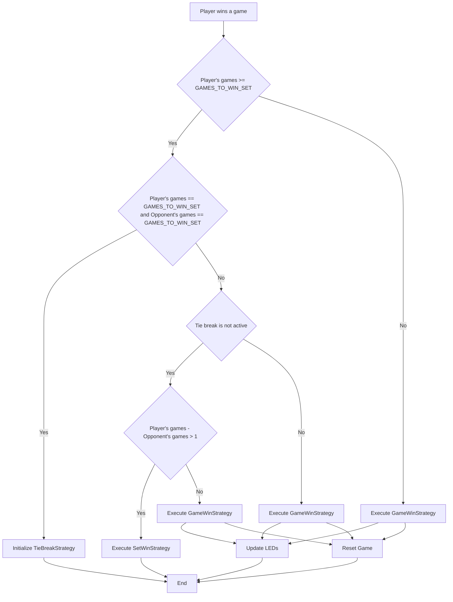

```mermaid
graph TD
    A[Player wins a game] --> B{Player's games >= GAMES_TO_WIN_SET}
    B -->|Yes| C{Player's games == GAMES_TO_WIN_SET and Opponent's games == GAMES_TO_WIN_SET}
    B -->|No| D1[Execute GameWinStrategy]
    C -->|Yes| E[Initialize TieBreakStrategy]
    C -->|No| F{Tie break is not active}
    F -->|Yes| G{Player's games - Opponent's games > 1}
    G -->|Yes| H[Execute SetWinStrategy]
    G -->|No| I[Execute GameWinStrategy]
    F -->|No| J[Execute GameWinStrategy]
    D1 --> K[Update LEDs]
    D1 --> L[Reset Game]
    I --> K
    I --> L
    J --> K
    J --> L
    E --> M[End]
    H --> M
    K --> M
    L --> M

```
