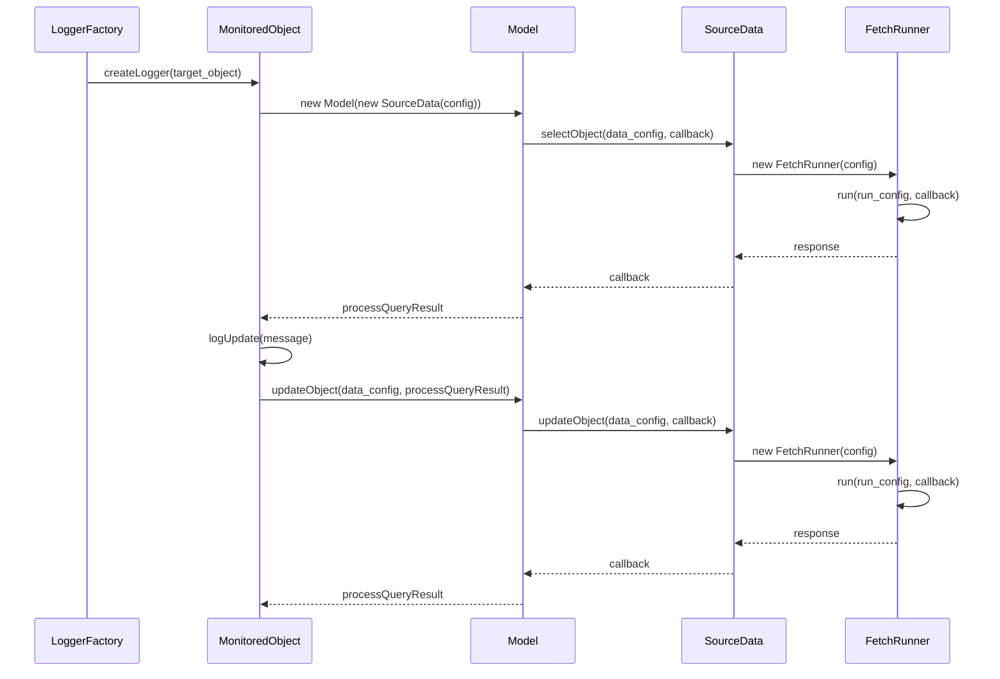

# Persona
- You are a world-class C++ developer.
- You are an expert at translating JavaScript to C++.
- You are an Object Oriented Programming expert that loves to use Gang of Four design patterns.

# Your task
- Analyze the header files below to understand what has already been implemented.
- Create MonitoredObject .h and .cpp files using the JavaScript MonitoredObject.js provided below as a guide.
- Clone all of the variables and methods provided in the JavaScript MonitoredObject class.
- If you think anything should be added, include it in your answer.

## Javascript MonitoredObject object to use as a guide
```javascript
/** @class  MonitoredObject */
class MonitoredObject {
    object_view_id;
    logObjects;
    model;
    logObjectFactory;
    monitorLed;
    data_config;
    constructor( config ) {
        this.object_view_id = config.new_id.includes( "_" ) ? config.new_id : `${this.constructor.name}_${config.new_id}`;
        this.logObjects = [];
        this.model = new Model( new SourceData( config ) );
        this.logObjectFactory = new LogObjectFactory();
        this.monitorLed = new MonitorLed();
        const data_config = { object_view_id: this.object_view_id, object_data: JSON.stringify( this ) };
        this.model.insertObject( data_config, this.processQueryResult ); }

    logUpdate ( message ) {
        if ( !this.object_view_id ) { console.log( "*** ERROR: object needs an id to log. ***" ); return; }
        if ( message.includes( "ERROR"    )) { this.monitorLed.setFail(); }
        if ( message.includes( "finished" )) { this.monitorLed.setPass(); }
        this.monitorLed.setLedText( message );
        this.logObjects.push( this.logObjectFactory.createLogObject( message, this ) );
        const data_config = { object_view_id: this.object_view_id, object_data: JSON.stringify( this ) };
        this.model.updateObject( data_config, this.processQueryResult ); }
    processQueryResult ( _event, results ) { if ( results.data.length > 0 ) { console.log( results.data ); }}
    getObjectViewId () { return this.object_view_id; }
}
```

## C++ Model.h
```cpp
#ifndef MODEL_H
#define MODEL_H

#include "../SourceData/SourceData.h"
#include <functional>
#include <string>

class Model {
public:
    explicit Model(SourceData* sourceData);
    
    void selectObject(const std::string& object_view_id, const std::function<void(const std::string&)>& callback);
    void selectAllObjects(const std::function<void()>& callback);
    void insertObject(const std::string& object_view_id, const std::string& object_data, const std::function<void()>& callback);
    void updateObject(const std::string& object_view_id, const std::string& object_data, const std::function<void()>& callback);

private:
    SourceData* sourceData;
};
#endif // MODEL_H
```

## C++ SourceData.h
```cpp
#ifndef SOURCEDATA_H
#define SOURCEDATA_H

#include <string>
#include <functional>
#include "../FetchRunner/FetchRunner.h"
#include "../MonitoredObjectStructures.h"

class SourceData {
public:
    explicit SourceData(const std::string& url);
    
    void selectAllObjects(const std::function<void()>& callback);
    void selectObject(const std::string& object_view_id, const std::function<void(const std::string&)>& callback);
    void insertObject(const std::string& object_view_id, const std::string& object_data, const std::function<void()>& callback);
    void updateObject(const std::string& object_view_id, const std::string& object_data, const std::function<void()>& callback);

private:
    std::string url;
    std::string api_path;

    // Helper methods for making HTTP requests
    void get(const APIConfigStruct& config, std::function<void(const std::string&)> callback);
    void post(const std::string& api_path, const std::string& data, const std::function<void()>& callback);
};

#endif // SOURCEDATA_H
```

## C++ FetchRunner.h
```cpp
#ifndef FETCHRUNNER_H
#define FETCHRUNNER_H

#include <string>
#include <functional>
#include <curl/curl.h>

class FetchRunner {
public:
    FetchRunner(const std::string& config);
    ~FetchRunner();

    void run(const std::string& apiArgsType, const std::string& apiArgs, std::function<void(const std::string&)> callback);

private:
    std::string url;
    struct curl_slist* url_encoded_header;
    struct curl_slist* json_header;
    CURL* curl;

    void initializeCurl();
    void setupHeaders();
    static size_t writeCallback(void* contents, size_t size, size_t nmemb, void* userp);
};
#endif // FETCHRUNNER_H
```

## C++ MonitoredObjectStructures.h
```cpp
#include <string>

struct MonitorLedConfigStruct {
    std::string new_id;
    std::string table;
};

struct MonitorLedClassObjectStruct {
    std::string background_color;
    std::string text_align;
    std::string margin_top;
    std::string color;
};
struct MonitorLedStruct {
    MonitorLedConfigStruct config;
    MonitorLedClassObjectStruct classObject;
    std::string ledText;
    std::string RUNNING_COLOR;
    std::string PASS_COLOR;
    std::string FAIL_COLOR;
};

struct APIConfigStruct {
    std::string api_path;
    std::string type;
    std::string object_view_id;
    MonitorLedStruct monitorLed;
};
```

## C++ LogObjectFactory.h
```cpp
#ifndef LOG_OBJECT_FACTORY_H
#define LOG_OBJECT_FACTORY_H

#include "../LogObject/LogObject.h"
#include <string>
#include <memory>

class LogObjectFactory {
public:
    LogObjectFactory();
    ~LogObjectFactory();

    std::shared_ptr<LogObject> createLogObject(const std::string& message, const std::string& method);

private:
    std::string generateUniqueId();
    uint64_t getCurrentTimestamp();
};
#endif // LOG_OBJECT_FACTORY_H
```

## C++ LogObject.h
```cpp
#ifndef LOGOBJECT_H
#define LOGOBJECT_H

#include <string>
#include <cstdint>

class LogObject {
public:
    LogObject();
    ~LogObject();

    const std::string& getId() const;
    void setId(const std::string& id);

    uint64_t getTimestamp() const;
    void setTimestamp(uint64_t timestamp);

    const std::string& getMessage() const;
    void setMessage(const std::string& message);

    const std::string& getMethod() const;
    void setMethod(const std::string& method);

private:
    std::string id;
    uint64_t timestamp;
    std::string message;
    std::string method;
};
#endif // LOGOBJECT_H
```

## C++ MonitorLed.h
```cpp
#ifndef MONITOR_LED_H
#define MONITOR_LED_H

#include "../MonitorLedClassObject/MonitorLedClassObject.h"
#include <string>

class MonitorLed {
public:
    MonitorLed();

    void setFail();
    void setPass();
    void setLedBackgroundColor(const std::string& newColor);
    void setLedTextColor(const std::string& newColor);
    void setLedText(const std::string& newText);

private:
    MonitorLedClassObject classObject;
    std::string ledText;
    static const std::string RUNNING_COLOR;
    static const std::string PASS_COLOR;
    static const std::string FAIL_COLOR;
};
#endif // MONITOR_LED_H
```

## C++ MonitorLedClassObject.h
```cpp
#ifndef MONITOR_LED_CLASS_OBJECT_H
#define MONITOR_LED_CLASS_OBJECT_H

#include <string>

class MonitorLedClassObject {
public:
    MonitorLedClassObject();

    std::string getBackgroundColor() const;
    void setBackgroundColor(const std::string& color);
    std::string getTextAlign() const;
    void setTextAlign(const std::string& textAlign);
    std::string getMarginTop() const;
    void setMarginTop(const std::string& marginTop);
    std::string getColor() const;
    void setColor(const std::string& color);

private:
    std::string background_color;
    std::string text_align;
    std::string margin_top;
    std::string color;
};
#endif // MONITOR_LED_CLASS_OBJECT_H
```

# The system diagram


