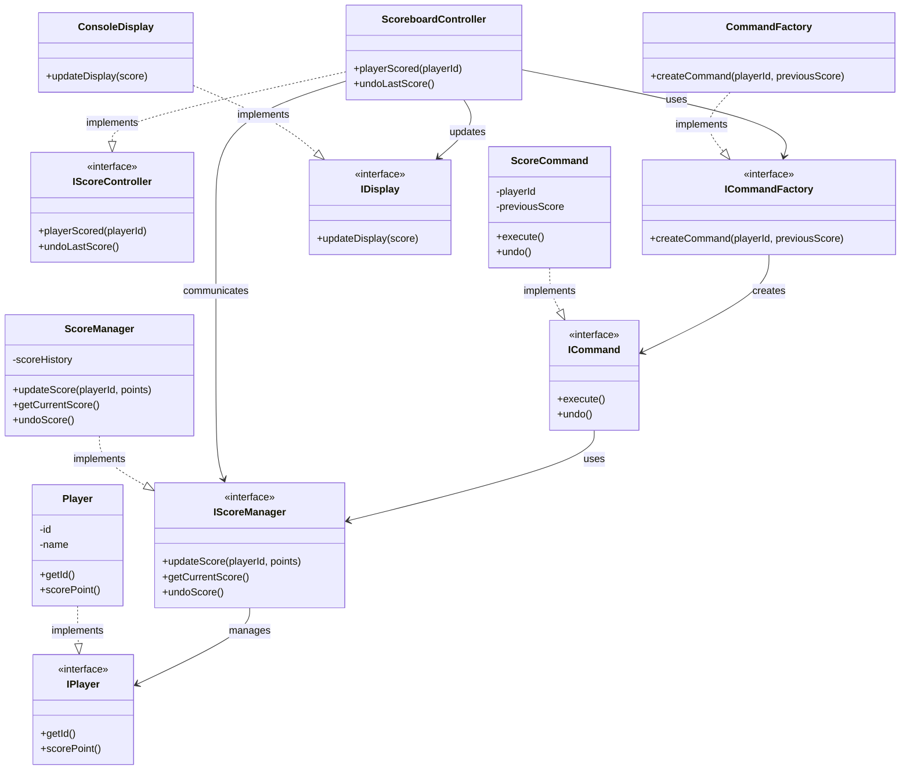

GMT-05
THU
14
1 AM
2 AM
3 AM
4 AM
5 AM
6 AM
7 AM
8 AM
9 AM
10 AM
11 AM
12 PM
1 PM
2 PM
3 PM
4 PM
5 PM
6 PM
7 PM
8 PM
9 PM
10 PM
11 PM
fix the serve problem
Thursday, December 14⋅8:45 – 11:45am

```mermaid
classDiagram
    class IScoreController {
      <<interface>>
      +playerScored(playerId)
      +undoLastScore()
    }

    class ScoreboardController {
      +playerScored(playerId)
      +undoLastScore()
    }

    class IScoreManager {
      <<interface>>
      +updateScore(playerId, points)
      +getCurrentScore()
      +undoScore()
    }

    class ScoreManager {
      +updateScore(playerId, points)
      +getCurrentScore()
      +undoScore()
      -scoreHistory
    }

    class IPlayer {
      <<interface>>
      +getId()
      +scorePoint()
    }

    class Player {
      -id
      -name
      +getId()
      +scorePoint()
    }

    class ICommand {
      <<interface>>
      +execute()
      +undo()
    }

    class ScoreCommand {
      -playerId
      -previousScore
      +execute()
      +undo()
    }

    class IDisplay {
      <<interface>>
      +updateDisplay(score)
    }

    class ConsoleDisplay {
      +updateDisplay(score)
    }

    class ICommandFactory {
      <<interface>>
      +createCommand(playerId, previousScore)
    }

    class CommandFactory {
      +createCommand(playerId, previousScore)
    }

    ScoreboardController ..|> IScoreController : implements
    ScoreManager ..|> IScoreManager : implements
    Player ..|> IPlayer : implements
    ScoreCommand ..|> ICommand : implements
    ConsoleDisplay ..|> IDisplay : implements
    CommandFactory ..|> ICommandFactory : implements

    ScoreboardController --> ICommandFactory : uses
    ICommandFactory --> ICommand : creates
    ScoreboardController --> IScoreManager : communicates
    IScoreManager --> IPlayer : manages
    ICommand --> IScoreManager : uses
    ScoreboardController --> IDisplay : updates
```
