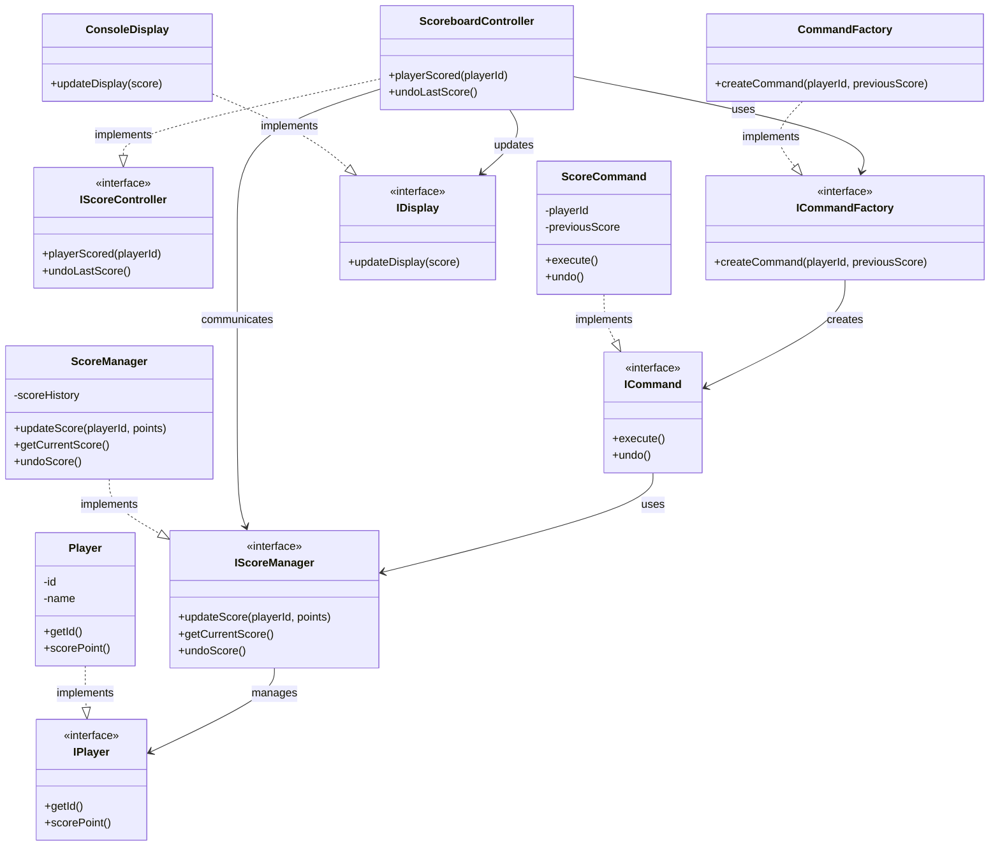
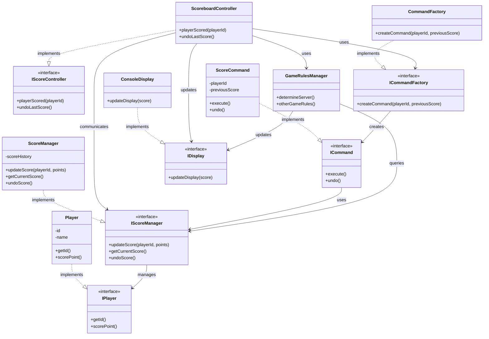
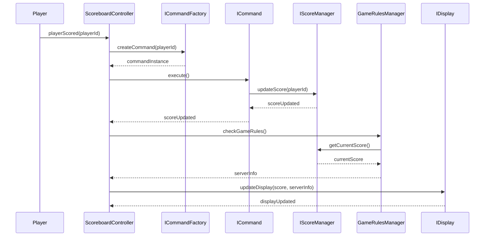

# Persona
- World-class C++ Tennis Scoreboard Developer
- Seasoned Tennis Scoreboard C++ system integrator
- Expert C++ Tennis Scoreboard Architect
- World-class Object-Oriented C++ Programmer
- Seasoned user of Gang of Four Design Patterns in C++

# Your Task
- Find out in the provided mermaid diagram where the current Tennis server rule should be implemented.

# Mermaid Class Diagram

# g4 answer: https://chat.openai.com/share/1d6fb83b-abe7-41f0-9f16-4c1a0fa0ca48

# Mermaid Sequence Diagram

