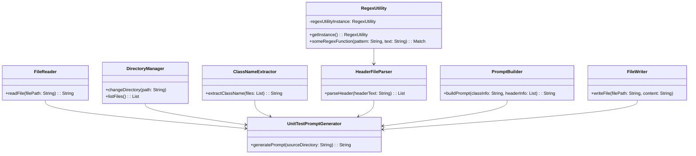
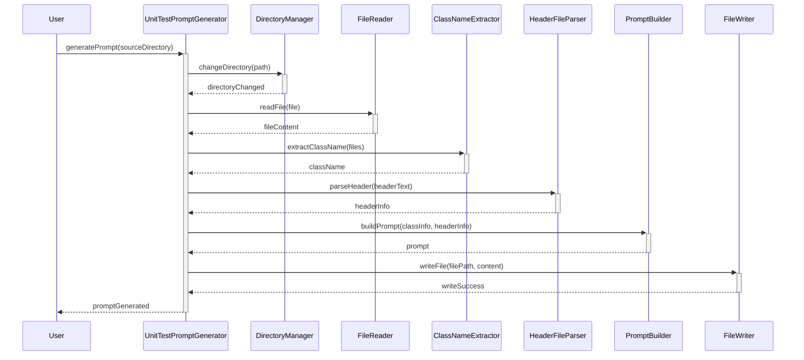

# Persona
- World-class Python developer
- Top-tier Object-Oriented developer seasoned in Gang of Four design patterns

# Your task
- Analyze the Python file below and break it up into different objects so that each object only has a single responsibility.
- If you see any opportunity to use a Gang of Four design pattern, implement it.
- Create a mermaid sequence diagram to show the relationships between the objects.

# Python file to refactor
```python
# tool to create a unit test prompt for a given class

import sys
import os
import re

source_directory = input ( "Enter the source directory: " )

# list the files in the current directory and get the class name from the .h file
class_name = ''
# change directory to os.getcwd() + "/tennis-game/LogObjectContainer"
os.chdir( "/home/adamsl/rpi-rgb-led-matrix/tennis-game/" + source_directory )

# print the current directory
print( "current directory: " )
print( os.getcwd() )

files = os.listdir(  )
for file in files:
    if re.search('.h', file):
        class_name = file.split('.')[0]
        break

header_file_text = open(class_name + '.h', 'r').read()
cpp_file_text    = open(class_name + '.cpp', 'r').read()

# start building the prompt
prompt = """
# Persona
- World-class C++ developer
- Expert at using C++ Google Unit Test Framework

# Goal
- Create a detailed exhaustive Google Unit test for the class: """ + class_name + """

# Header file for the class: """ + class_name + """
```cpp
""" + header_file_text + """
```

# Cpp file for the class: """ + class_name + """
```cpp
""" + cpp_file_text + """
```
"""

header_file = open( class_name + '.h', 'r')
header_file_text = header_file.read()
print ( header_file_text )


header_files = []
for line in header_file_text.split('\n'):
    if re.search('#include', line):
        print(line)
        # pull out the path to the header file
        # pull out the name of the header file
        regex = re.compile('#include "(.*)"')
        match = regex.search(line)
        # if there is a match add it to the array of header files
        if match:
            print( "appending: " + match.group(1))
            header_files.append(match.group(1))
            

# loop through the header files and add them to the prompt
prompt += """
# Header files for the class: """ + class_name + """\n
"""
print ( "entering header files loop..." )
for header_file in header_files:
    print( header_file )
    # open the each header file and add it to the prompt
    added_header_file = open(header_file, 'r')
    header_file_text = added_header_file.read()
    prompt += """
    \n### Header file: """ + header_file + """    
```cpp
""" + header_file_text + """
```\n
"""
    

prompt += """
## Working example Google Unit Test for the the Mode1Score class

```cpp
#include "Mode1Score.h"
class Mode1ScoreTest : public ::testing::Test {
protected:
    Player* _player1;
    Player* _player2;
    PinInterface* _pinInterface;
    GameState* _gameState;
    History* _history;
    Mode1Score* _mode1Score;

    void SetUp() override;
    void TearDown() override;
};

void Mode1ScoreTest::SetUp() {
    _gameState = new GameState();
    _player1 = new Player( _gameState, PLAYER_1_INITIALIZED );
    _player2 = new Player( _gameState, PLAYER_2_INITIALIZED );
    _player1->setOpponent( _player2 ); _player2->setOpponent( _player1 );
    std::map<std::string, int> pin_map;
    PinState* pin_state = new PinState( pin_map );
    _pinInterface = new PinInterface( pin_state );
    _history = new History();
    _mode1Score = new Mode1Score( _player1, _player2, _pinInterface, _gameState, _history );
}

// Tear down the test fixture
void Mode1ScoreTest::TearDown() {
    delete _mode1Score;
    delete _history;
    delete _gameState;
    delete _pinInterface;
    delete _player2;
    delete _player1;
}


///////////////// Test case: Test Mode 1 P1 Score Less Than 3 Points //////////
TEST_F( Mode1ScoreTest, TestMode1P1Score_LessThan3Points ) {
    _player1->setPoints( 2 );
    _player2->setPoints( 1 );
    _mode1Score->updateScore( _player1 );
    EXPECT_EQ( _player1->getPoints(), 2);
    EXPECT_EQ( _player2->getPoints(), 1 );
    // Check other changes made by the method
}
////////////////////////////////////////////////////////////////////////////////
```
"""

# open the file to write to
prompt_file = open('unit_test_prompt.md', 'w')

# write the prompt to a file
prompt_file.write( prompt )

## Mermaid class diagram


## Mermaid sequence diagram

